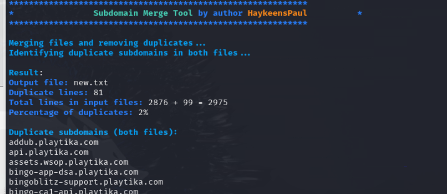

# Subdomain Merger and Duplicate Percentage Calculator

This script is designed to merge multiple lists of subdomains simultaneously , remove duplicates, and calculate the percentage of duplicates between the two input files.



## Features
- **Merges two subdomain files**: Combines subdomains from two input files into one.
- **Removes duplicates**: Only unique subdomains will be retained in the output file.
- **Calculates duplicate percentage**: Computes the percentage of duplicate subdomains between the two input files.

## Prerequisites
Before running the script, ensure you have the following:
- A **Bash shell** (Linux, macOS, or Windows with WSL).
- **Two input files** containing lists of subdomains.

## Usage

### Running the Script

To run the script, execute the following command in your terminal:

```bash
./merge_and_calculate_duplicates.sh <subdomains1.txt> <subdomains2.txt> <subdomain....txt> <output_file.txt>
